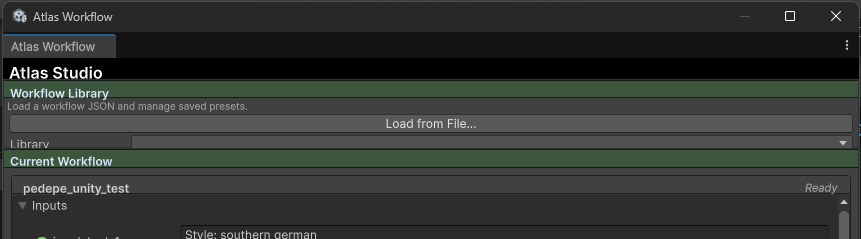

<p align="center">
  
</p>

<h1 align="center">Atlas Workflow</h1>

<p align="center">
  <strong>A powerful Unity Editor plugin for orchestrating and executing Atlas Platform workflows</strong>
</p>

<p align="center">
  
  
  
  
</p>

<p align="center">
  <a href="#-features">Features</a> •
  <a href="#-installation">Installation</a> •
  <a href="#-quick-start">Quick Start</a> •
  <a href="#-documentation">Documentation</a> •
  <a href="#-configuration">Configuration</a> •
  <a href="#-contributing">Contributing</a>
</p>

---

## 📋 Table of Contents

- [Overview](#-overview)
- [Features](#-features)
- [Screenshots](#-screenshots)
- [Requirements](#-requirements)
- [Installation](#-installation)
- [Quick Start](#-quick-start)
- [Documentation](#-documentation)
  - [Core Concepts](#core-concepts)
  - [Workflow Schema](#workflow-schema)
  - [Input Types](#input-types)
  - [Output Types](#output-types)
- [Configuration](#-configuration)
- [File Structure](#-file-structure)
- [Troubleshooting](#-troubleshooting)
- [License](#-license)

---

## 🎯 Overview

**Atlas Workflow** is a Unity Editor plugin that brings the power of Atlas Platform workflows directly into your Unity development environment. Design, execute, and iterate on AI-powered asset generation pipelines without leaving the editor.

Whether you're generating textures, creating 3D models, or running complex multi-step AI pipelines, Atlas Workflow provides a seamless interface for managing your creative automation workflows.

### Why Atlas Workflow?

- **Native Unity Integration** — Execute workflows directly from the Unity Editor
- **Type-Safe Inputs** — Structured UI for all parameter types with validation
- **Asset Pipeline Support** — Automatic export of textures (PNG) and meshes (GLB)
- **Full Job History** — Track, inspect, and replay any previous workflow execution
- **Production-Ready** — Built for iterative, professional game development workflows

---

## ✨ Features

### Workflow Management
- 📁 **Workflow Library** — Import, organize, and switch between multiple workflow definitions
- 🔄 **Hot-Reload Support** — Update workflow definitions without restarting Unity

### Intelligent Input System
- 🎨 **Image Inputs** — Drag-and-drop textures from your project or browse external files
- 🧊 **Mesh Inputs** — Use prefabs, models, or external GLB/FBX files
- 🔢 **Primitive Inputs** — Boolean toggles, numeric sliders, and text fields
- 📂 **Dual Source Support** — Choose between project assets or file system paths

### Execution & Monitoring
- ▶️ **One-Click Execution** — Run workflows with a single button press
- 📊 **Live Progress Tracking** — Monitor running jobs in real-time
- ⏱️ **Configurable Timeouts** — Set execution limits from 1 minute to 1 hour (or unlimited)
- 🔔 **Completion Notifications** — Get notified when jobs finish or fail

### Job History & Results
- 📜 **Complete History** — Browse all past workflow executions
- 🔍 **Full Inspection** — View exact inputs and outputs for any historical job
- 💾 **Persistent Storage** — Job history survives editor restarts
- 📥 **Asset Import** — Import generated assets directly into your project
- 📂 **File Reveal** — Quick access to output files in your file explorer

### Asset Pipeline
- 🖼️ **Texture Export** — Automatic PNG conversion with GPU decompression
- 🎮 **GLB Export** — Full glTF 2.0 binary export via glTFast
- 🧹 **Temp File Management** — Configurable cleanup with storage limits

---

## 📸 Screenshots

<p align="center">
  
  <br/>
  <em>Main Editor Window — Load workflows, configure inputs, and execute</em>
</p>

<p align="center">
  
  <br/>
  <em>Type-aware input fields with project asset and file path support</em>
</p>

<p align="center">
  
  <br/>
  <em>Job History — Browse, filter, and inspect past workflow executions</em>
</p>

<p align="center">
  
  <br/>
  <em>Running Jobs Panel — Monitor active workflow executions</em>
</p>

<p align="center">
  
  <br/>
  <em>Project Settings — Configure save paths, timeouts, and notifications</em>
</p>

---

## 📦 Requirements

| Requirement | Version |
|-------------|---------|
| **Unity** | 2022.3 LTS or newer |
| **Newtonsoft JSON** | 3.2.2+ (auto-installed) |
| **glTFast** | 6.14.1+ (auto-installed) |

> **Note:** An active Atlas Platform backend connection is required for workflow execution.

---

## 🚀 Installation

### Option A: Install via Git URL (Recommended)

1. Open Unity and navigate to **Window → Package Manager**
2. Click the **+** button in the top-left corner
3. Select **Add package from git URL...**
4. Paste the following URL:

```
https://github.com/Atlas-Design/AtlasPlatform_UnityPlugin.git
```

5. Click **Add** and wait for the installation to complete

### Option B: Install from Disk (Local Development)

1. Clone or download this repository:

```bash
git clone https://github.com/Atlas-Design/AtlasPlatform_UnityPlugin.git
```

2. In Unity, navigate to **Window → Package Manager**
3. Click the **+** button and select **Add package from disk...**
4. Navigate to the cloned repository and select `package.json`

### Verifying Installation

After installation, you should see:
- **Window → Atlas Workflow** menu item
- **Edit → Project Settings → Atlas Workflow** settings section

---

## 🏃 Quick Start

### Step 1: Open the Editor Window

Navigate to **Window → Atlas Workflow** to open the main editor window.

<p align="center">
  
</p>

### Step 2: Configure Settings

Go to **Edit → Project Settings → Atlas Workflow** and configure:

- **Asset Save Folder** — Where imported assets will be saved (must be inside `Assets/`)
- **API Timeout** — Maximum time to wait for workflow completion
- **Notifications** — Enable/disable completion dialogs

<p align="center">
  
</p>

### Step 3: Import a Workflow

1. Click the **Import** button in the editor window
2. Select a workflow JSON file from your file system
3. The workflow will be added to your library and loaded automatically

<p align="center">
  
</p>

### Step 4: Configure Inputs

Fill in the required inputs for your workflow:

| Input Type | How to Set |
|------------|------------|
| **Boolean** | Toggle checkbox |
| **Number** | Enter numeric value |
| **String** | Type text in field |
| **Image** | Drag texture from project OR click browse for external file |
| **Mesh** | Drag prefab from project OR click browse for external file |

### Step 5: Execute

Click the **▶ Run [Workflow Name]** button to execute. Monitor progress in the Running Jobs panel.

### Step 6: View Results

- **Live Results** — Outputs appear in the main view after completion
- **History** — All executions are saved in the Job History panel
- **Import Assets** — Click import buttons on asset outputs to add them to your project

---

## 📖 Documentation

### Core Concepts

#### Workflow

A **Workflow** is a JSON definition that describes:
- **Inputs** — Parameters required to execute the workflow
- **Outputs** — Results produced by the workflow
- **Metadata** — API endpoint, version, and identification info

Workflows are stored in a local library (`Application.persistentDataPath/AtlasWorkflowLibrary/`).

#### Job

A **Job** represents a single execution of a workflow. Each job contains:

| Property | Description |
|----------|-------------|
| `JobId` | Unique identifier (GUID) |
| `WorkflowId` | Reference to the source workflow |
| `Status` | Running, Succeeded, or Failed |
| `CreatedAtUtc` | Execution start time |
| `CompletedAtUtc` | Execution end time |
| `InputsSnapshot` | Frozen copy of input values at execution time |
| `OutputsSnapshot` | Generated output values |
| `ErrorMessage` | Error details (if failed) |

Jobs are **immutable** once completed, ensuring historical accuracy.

#### Live View vs History View

| Aspect | Live View | History View |
|--------|-----------|--------------|
| **Inputs** | Editable | Read-only |
| **Outputs** | Updates after completion | Frozen snapshot |
| **Actions** | Execute workflow | Reveal/import files |
| **Purpose** | Current work | Audit trail |

---

### Workflow Schema

Workflow definitions use the following JSON schema:

```json
{
  "version": "v1",
  "api_id": "my-workflow-001",
  "base_url": "api.atlas-platform.com",
  "name": "My Awesome Workflow",
  "inputs": [
    {
      "id": "input_texture",
      "type": "image",
      "label": "Source Texture"
    },
    {
      "id": "strength",
      "type": "number",
      "label": "Effect Strength",
      "default_value": 0.5
    }
  ],
  "outputs": [
    {
      "id": "result_image",
      "type": "image",
      "format": "png"
    }
  ]
}
```

#### Schema Reference

| Field | Type | Required | Description |
|-------|------|----------|-------------|
| `version` | string | ✅ | API version (e.g., "v1") |
| `api_id` | string | ✅ | Unique workflow identifier |
| `base_url` | string | ✅ | Atlas Platform endpoint |
| `name` | string | ✅ | Human-readable workflow name |
| `inputs` | array | ✅ | Input parameter definitions |
| `outputs` | array | ✅ | Output parameter definitions |

---

### Input Types

| Type | JSON Value | Unity UI | Export Format |
|------|------------|----------|---------------|
| `boolean` | `true`/`false` | Toggle | JSON boolean |
| `number` | `0.0` | Float field | JSON number |
| `string` | `"text"` | Text field | JSON string |
| `image` | — | Object field + file picker | PNG file |
| `mesh` | — | Object field + file picker | GLB file |

#### Image Input Sources

```
┌─────────────────────────────────────────┐
│  Image Input                            │
├─────────────────────────────────────────┤
│  ○ Project Asset                        │
│    [Texture2D field]                    │
│                                         │
│  ○ External File                        │
│    [File path] [Browse...]              │
└─────────────────────────────────────────┘
```

#### Mesh Input Sources

```
┌─────────────────────────────────────────┐
│  Mesh Input                             │
├─────────────────────────────────────────┤
│  ○ Project Asset                        │
│    [GameObject/Prefab field]            │
│                                         │
│  ○ External File                        │
│    [File path] [Browse...]              │
└─────────────────────────────────────────┘
```

---

### Output Types

| Type | Result | Actions Available |
|------|--------|-------------------|
| `boolean` | Checkbox display | Copy value |
| `number` | Numeric display | Copy value |
| `string` | Text display | Copy value |
| `image` | Image preview | Import to project, Reveal in explorer |
| `mesh` | File reference | Import to project, Reveal in explorer |

---

## ⚙️ Configuration

Access settings via **Edit → Project Settings → Atlas Workflow**

### General Settings

| Setting | Default | Description |
|---------|---------|-------------|
| **Asset Save Folder** | `Assets/AtlasOutputs` | Where imported assets are saved |

### Execution Settings

| Setting | Default | Range | Description |
|---------|---------|-------|-------------|
| **API Timeout** | 10 minutes | 1 min – 60 min (or No Limit) | Maximum wait time for API responses |
| **Notify on Complete** | ✅ Enabled | — | Show dialog when jobs finish |

### Storage Settings

| Setting | Default | Range | Description |
|---------|---------|-------|-------------|
| **Max Temp Storage** | 500 MB | 100 MB – 5 GB | Warning threshold for temp files |
| **Warn on Exceeded** | ✅ Enabled | — | Log warning when limit exceeded |

### Logging Settings

| Setting | Default | Description |
|---------|---------|-------------|
| **Verbose Logging** | ❌ Disabled | Enable detailed debug logs |

---

## 📁 File Structure

### Plugin Structure

```
com.atlas.workflow/
├── Editor/
│   ├── EditorWindow/           # UI components
│   │   ├── Elements/           # UXML templates
│   │   ├── Params/             # Parameter input templates
│   │   └── Styles/             # USS stylesheets
│   └── Logic/                  # Core functionality
│       ├── AtlasAPIController.cs
│       ├── AssetExporter.cs
│       ├── SettingsManager.cs
│       ├── WorkflowManager.cs
│       └── WorkflowDefinition.cs
├── Docs~/
│   └── Images/                 # Documentation images
├── Tests/
│   └── TestAssets/             # Test files
├── package.json
├── LICENSE
└── README.md
```

### Runtime Data Locations

| Data | Location | Persistence |
|------|----------|-------------|
| **Workflow Library** | `Application.persistentDataPath/AtlasWorkflowLibrary/` | Permanent |
| **Job History** | `[ProjectRoot]/AtlasWorkflowJobs/` | Permanent |
| **Temporary Files** | `System.IO.Path.GetTempPath()/UnityAtlasWorkflow/` | Auto-cleanup (7 days) |
| **Imported Assets** | Configurable (default: `Assets/AtlasOutputs/`) | Permanent |

### Job Folder Structure

```
AtlasWorkflowJobs/
└── My_Workflow/
    └── 2026-01-22_14-30-45_a1b2c3d4/
        ├── job.json              # Job metadata & snapshots
        ├── inputs/
        │   ├── Input_texture.png
        │   └── Input_mesh.glb
        └── outputs/
            ├── Output_result.png
            └── Output_model.glb
```

---


## 🔧 Troubleshooting

### Common Issues

#### "Workflow execution failed"

**Possible causes:**
- Network connectivity issues
- Invalid API endpoint in workflow definition
- API timeout exceeded

**Solutions:**
1. Check your internet connection
2. Verify `base_url` in workflow JSON is correct
3. Increase timeout in Project Settings

#### "Failed to export texture/mesh"

**Possible causes:**
- Asset is not readable (texture compression)
- Missing glTFast package

**Solutions:**
1. For textures: Ensure "Read/Write" is enabled in import settings
2. Verify glTFast package is installed correctly
3. Check Console for detailed error messages

#### "Job history not loading"

**Possible causes:**
- Corrupted job.json files
- Permission issues with job folders

**Solutions:**
1. Check `[ProjectRoot]/AtlasWorkflowJobs/` for corrupted files
2. Delete problematic job folders manually
3. Ensure write permissions on the directory

#### "Temp storage warning"

**Cause:** Temporary files exceed configured limit

**Solutions:**
1. Go to **Project Settings → Atlas Workflow**
2. Click "Clear All Temp Files" or increase the limit
3. Temp files auto-cleanup after 7 days

### Verbose Logging

Enable verbose logging for detailed diagnostics:

1. Go to **Edit → Project Settings → Atlas Workflow**
2. Enable **Verbose Logging**
3. Check the Console window for detailed logs with prefixes:
   - `[Atlas/API]` — API communication
   - `[Atlas/File]` — File operations
   - `[Atlas/Job]` — Job lifecycle events

---

## 📄 License

This project is licensed under the **MIT License** — see the [LICENSE](LICENSE) file for details.

```
MIT License

Copyright (c) 2026 Atlas

Permission is hereby granted, free of charge, to any person obtaining a copy
of this software and associated documentation files (the "Software"), to deal
in the Software without restriction, including without limitation the rights
to use, copy, modify, merge, publish, distribute, sublicense, and/or sell
copies of the Software...
```


---

<p align="center">
  <strong>Built with ❤️ by the Atlas Team</strong>
</p>
