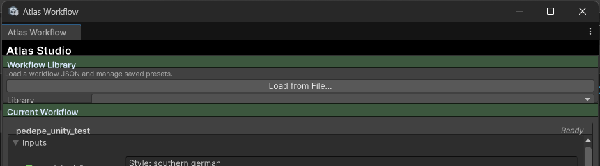
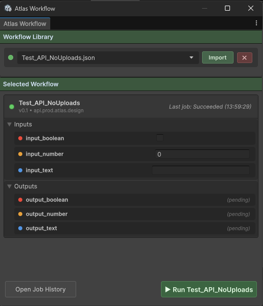
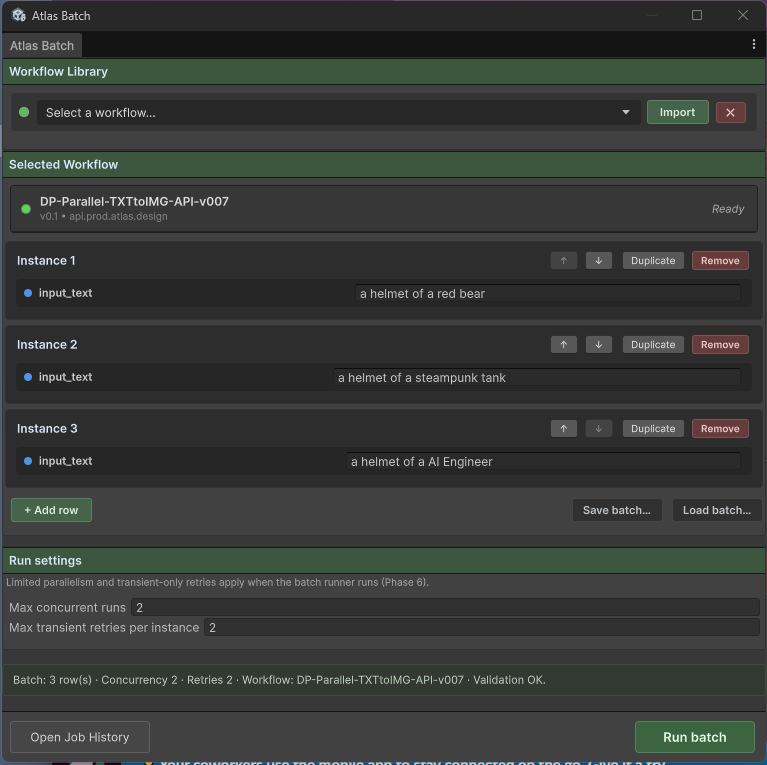
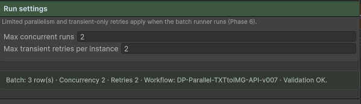
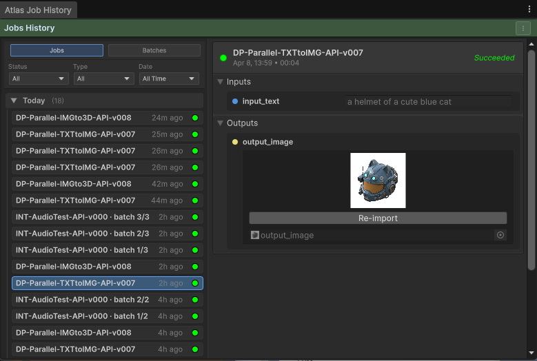
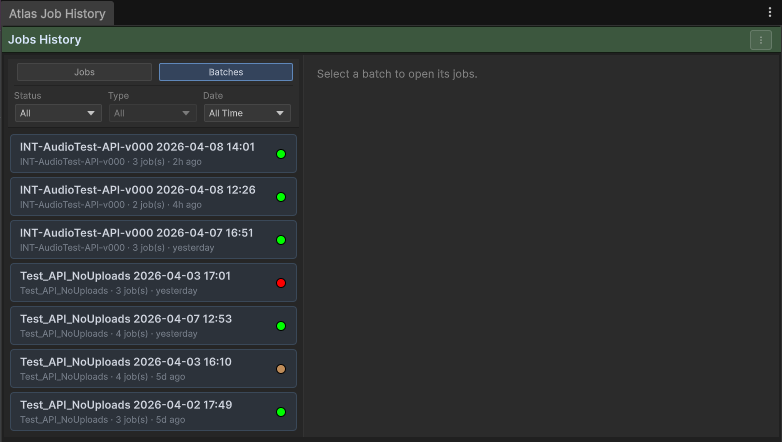
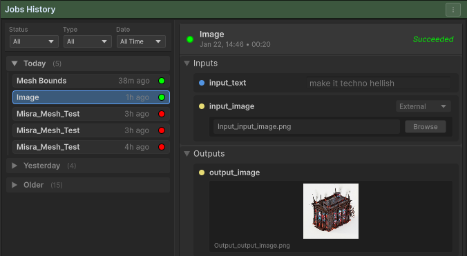
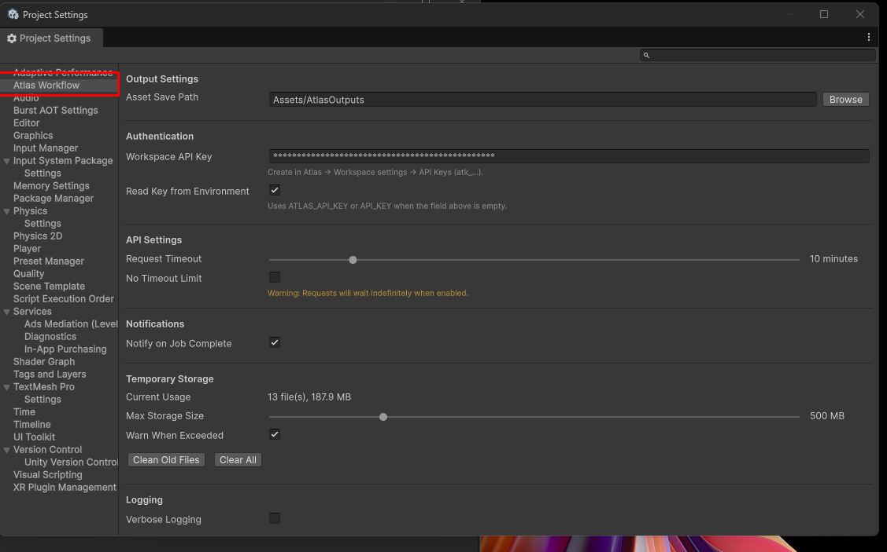
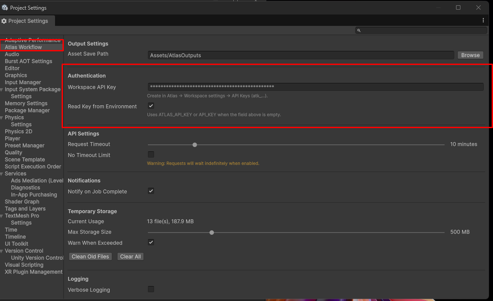
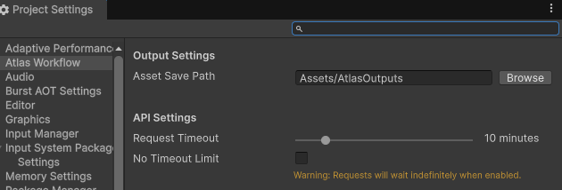

  

<h1 align="center">Atlas Workflow</h1>

  <strong>Run Atlas Platform workflows inside Unity — no coding required</strong>

  
  
  
  

  <a href="#-atlas-workflow-single-run">Single run</a> •
  <a href="#-atlas-batch">Batch</a> •
  <a href="#-atlas-job-history">Job history</a> •
  <a href="#-installation">Installation</a> •
  <a href="#-quick-start">Quick Start</a> •
  <a href="#-settings">Settings</a> •
  <a href="#-troubleshooting">Troubleshooting</a>

---

## 🎯 What this is

**Atlas Workflow** connects Unity to **Atlas Platform**: you load a workflow your team or Atlas provides, fill in the fields, press run, and get results (images, 3D models, audio files, and simple values) back in the editor.

You stay inside familiar Unity menus and windows — the plugin handles talking to the platform and saving your runs so you can look them up later.

---

## ✨ What you can do

- **Run a workflow once** — **Atlas → Atlas Workflow**: pick a workflow, set inputs, run, see outputs.
- **Run many variations** — **Atlas → Atlas Batch**: same workflow, multiple rows of inputs; save drafts, run or cancel the whole queue.
- **Watch progress and history** — **Atlas → Atlas Job History**: see what’s running, open past runs, and switch between a **Jobs** list and a **Batches** view when you use batch runs.
- **Bring results into the project** — import or reveal generated files from the UI when offered (textures, models, audio, etc.).
- **Adjust basics** — **Atlas → Atlas Workflow Settings** for your API key, save folder, how long to wait, and notifications.
- **Atlas Platform API v0.2** — workspace API key auth, async execution with polling, and version-aware upload/download URLs.

> **Note:** You need an **internet connection**, a **workspace API key** (for API **v0.2+** workflows), and **access to Atlas Platform**. Import workflow JSON exported for **API v0.2** from the Atlas Platform. Audio **outputs** are supported; uploading audio **as an input** is not supported in this version.

---

## 🪟 Atlas Workflow (single run)

**Menu:** **Atlas → Atlas Workflow**

This window is for **one workflow at a time**: pick what to run, fill in inputs, see outputs, and start a single run.

### Main areas

| Area | What it’s for |
|------|----------------|
| **Workflow Library** | **Dropdown** — switch between workflows you’ve already imported. **Import** — add a workflow from a **v0.2** `.json` file exported from Atlas Platform. **✕** — remove the selected workflow from the library (does not delete the file on disk). |
| **Selected Workflow** | Shows the **name and details** of the current workflow, then **Inputs** (everything you must set before running), then **Outputs** (what you’ll get back — previews and paths fill in after a successful run). |
| Bottom row | **Open Job History** — jumps to **Atlas → Atlas Job History** to watch runs or browse the past. **▶ Run …** — starts one execution using the values you entered (the button label includes the workflow name). |

### Typical flow

1. **Import** a workflow once, or pick an existing one in the dropdown.  
2. Set each input (textures/models from the project or **Browse** to a file on disk; toggles, numbers, and text as shown).  
3. Press **▶ Run …** and wait for the platform to finish.  
4. Use the output rows to **import** assets into the project or **reveal** files on disk when those actions appear.

  
   
  <em>Atlas Workflow — library at the top, selected workflow with inputs/outputs below</em>

Optional: add `Docs~/Images/EditorWindow_Annotated.png` (callouts for **Workflow Library**, **Selected Workflow**, **Open Job History**, **Run**) if you want a labeled variant — file not in the repo yet.

---

## 📋 Atlas Batch

**Menu:** **Atlas → Atlas Batch**  
**Window title:** **Atlas Batch**

Use this when you need the **same workflow many times** with **different inputs per row** (for example many variants or a small overnight queue). Each row becomes its **own saved run** in job history, grouped so you can review them together later.

### Main areas

| Area | What it’s for |
|------|----------------|
| **Workflow Library** | Same idea as the single-run window: **Import**, **dropdown**, and **✕** to manage which workflows exist in your library. |
| **Selected Workflow** | After you choose a workflow, this shows its **name** and a **read-only summary** of what inputs the batch will use. Below that, **one block per row** — each row is one full set of inputs for that workflow. Use **+ Add row**, **Duplicate**, **Remove**, **↑** / **↓** to build your queue. **Save batch…** / **Load batch…** store or restore a draft (your workflow must still be in the library when you load). |
| **Run settings** | Controls how the batch runs, such as **how many jobs at once** and **how many times to retry** when a run fails for a temporary reason (for example a network blip). Exact labels match the fields in the window. |
| Bottom bar | **Open Job History** — same as in the single-run window. **Run batch** — start every row. **Cancel batch** — stop adding new runs and cancel in-flight work from *this* batch (this is different from **Dismiss** on a card in the Job History window). |

### Typical flow

1. Import or select a workflow.  
2. Add rows and fill each row’s inputs.  
3. Adjust **Run settings** if your team recommends it.  
4. **Run batch** — follow progress in **Atlas → Atlas Job History**.  
5. **Save batch…** if you want to reuse the same queue later.

  
   
  <em>Atlas Batch — library, row queue, run settings, and <strong>Run batch</strong> / <strong>Cancel batch</strong></em>

  
   
  <em><strong>Run settings</strong> — how many jobs run at once and retry limits (labels match the live UI)</em>

---

## 📚 Atlas Job History

**Menu:** **Atlas → Atlas Job History**  
**Window title:** **Atlas Job History**

This is the **mission control** view: everything **currently running** plus the **archive of past runs**. You can leave it open while you work in the single-run or batch windows.

### Main areas

| Area | What it’s for |
|------|----------------|
| **Running Jobs** | A scrollable list of **active** (and very recent) runs. Each **card** shows status and shortcuts — for example **Cancel** when this window is tied to a single run you started from **Atlas Workflow**, or **Dismiss** to hide a card you don’t need to watch (often used for batch jobs). Hover tooltips may mention **batch** position when a run came from **Atlas Batch**. |
| **Jobs History** | The lower (or main) area lists **finished and past runs**. Pick a row to see **inputs and outputs** for that run on the side (read-only snapshot of what was sent and returned). Use the **⋮** menu on the header if your build exposes extra actions (for example refresh or maintenance). |
| **Jobs** / **Batches** | At the top of the history toolbar: **Jobs** — one entry **per run** (every single and batch job). **Batches** — one entry **per batch**, then open a batch to see **only** the runs that belonged to it; **← Batches** returns to the batch list. |
| **Status**, **Type**, **Date** | Filters for the list. Hover the filters for short explanations — some options behave differently in **Jobs** vs **Batches** mode (tooltips in the editor describe this). |

### When to use which mode

- **Jobs** — “Show me everything” or find one specific run quickly.  
- **Batches** — “I ran a batch yesterday — how did the whole group do?”

  
   
  <em><strong>Atlas Job History</strong> — Running Jobs, Jobs History, Jobs | Batches, and Status / Type / Date filters</em>

  
   
  <em><strong>Batches</strong> mode — catalog or drill-in; use <strong>← Batches</strong> to go back to the batch list</em>

  
   
  <em><strong>Jobs</strong> mode — select a run in the list to inspect inputs and outputs in the detail pane</em>

---

## 📷 Documentation images

| File | Status |
|------|--------|
| `Settings.png` | Present — full settings page ([Settings](#-settings)). |
| `Settings_KeyFields_API.png` | Present — **Authentication** callout ([Authentication](#authentication)). |
| `Settings_KeyFields.png` | Present — **Asset Save Path** and **Request Timeout** ([Output, API, and other settings](#output-api-and-other-settings)). |
| `EditorWindow_Annotated.png` | Not added yet — optional callout version of the single-run window ([Atlas Workflow](#-atlas-workflow-single-run)). |

All other images referenced in this README are present under `Docs~/Images/`.

---

## 📦 Requirements

- **Unity** 2023.1 or newer  
- **Atlas Platform** access — workflows point at your team’s platform URL (for example `https://api.prod-market.atlas.design`)  
- **Workspace API key** (`atk_...`) — required for workflows exported at **API v0.2+**; create one in Atlas **Workspace settings → API Keys**  
- Extra packages the plugin needs (JSON, GLB tools) are installed automatically with the package.

> **Legacy workflows:** JSON at **API v0.1** may still run without a key if your platform supports it. New exports should use **v0.2**.

---

## 🚀 Installation

### From Git URL (common)

1. **Window → Package Manager** → **+** → **Add package from git URL...**
2. Paste your team’s plugin URL (for example the Atlas Platform Unity plugin repo) and **Add**.

### From disk

1. **Window → Package Manager** → **+** → **Add package from disk...**
2. Choose the folder that contains `package.json`.

### After install

Under the top menu **Atlas** you should see **Atlas Workflow**, **Atlas Batch**, **Atlas Job History**, and **Atlas Workflow Settings**.  
You can also open settings via **Edit → Project Settings → Project → Atlas Workflow**.  
On newer Unity versions, an **Atlas** entry may also appear on the main toolbar (you can show or hide it from the toolbar’s right-click menu).

---

## 🏃 Quick Start

The three windows above (**Atlas Workflow**, **Atlas Batch**, **Atlas Job History**) are where you spend your time; these steps are the shortest path to a first successful run.

#### Step 1: Configure your API key

Open **Atlas → Atlas Workflow Settings** (or **Edit → Project Settings → Project → Atlas Workflow**) and set:

- **Workspace API Key** — your Atlas workspace key (`atk_...`), from **Workspace settings → API Keys** on the platform  
- Or enable **Read Key from Environment** and set `ATLAS_API_KEY` (or `API_KEY`) before launching Unity — useful for automation

Runs on **API v0.2+** workflows fail immediately if no key is configured.

#### Step 2: Open the Workflow window

Open **Atlas → Atlas Workflow**.

#### Step 3: Configure paths (optional)

In the same settings page, adjust **Asset Save Folder** (must be under `Assets/`) and **API Timeout** if you need longer runs.

#### Step 4: Import a workflow

1. Click **Import** in the Workflow Library.  
2. Choose a workflow **JSON exported for API v0.2** from the Atlas Platform.  
3. The workflow appears in the library dropdown.

#### Step 5: Configure and run

1. Fill in the fields (images and models from the project or **Browse** to a file on disk).  
2. Click **▶ Run …** and wait for the platform to finish.  
3. Open **Atlas → Atlas Job History** for **Running Jobs** and past runs.  
4. When a run finishes, use each output’s **import** or **reveal** actions where available.

**Batch (optional):** **Atlas → Atlas Batch** → choose the same workflow → add rows (each row is one run) → **Run batch**. To stop a batch you started there, use **Cancel batch** in that window. In **Atlas Job History**, use **Batches** to group batch runs, then open a batch to see its jobs; **← Batches** goes back.

---

## ⚙️ Settings

Open **Atlas → Atlas Workflow Settings** (or **Edit → Project Settings → Project → Atlas Workflow**). These options apply to **all** workflow and batch runs, not just one window.

  
   
  <em>Atlas Workflow Settings — output, authentication, API timeout, notifications, and storage</em>

  
   
  <em><strong>Authentication</strong> — <strong>Workspace API Key</strong> and <strong>Read Key from Environment</strong></em>

### Authentication

| Setting | Default | Description |
|---------|---------|-------------|
| **Workspace API Key** | *(empty)* | Bearer token for Atlas Platform (`atk_...`). Required for **API v0.2+** workflow runs. |
| **Read Key from Environment** | Enabled | When the key field is empty, use `ATLAS_API_KEY` or `API_KEY` from the environment |

Keys are sent as `Authorization: Bearer <key>` on upload, execute, status, and download requests.

### Output, API, and other settings

  
   
  <em><strong>Output</strong> and <strong>API</strong> — where results are saved and how long runs may wait</em>

| What | Why it matters |
|------|----------------|
| **Asset Save Folder** | Where imported results go (inside `Assets/`). |
| **API Timeout** | How long to wait before treating a run as stuck. |
| **Notifications** | Pop-up when a run finishes. |
| **Temp storage** | Warning if temporary files grow large; you can clear or raise the limit. |
| **Verbose logging** | Only if support asks — extra detail in the **Console**. |

---

## 💡 How it works (short)

- A **workflow** is a small JSON file exported from Atlas Platform. You don’t edit it in normal use — **Import** it once and pick it from the library.
- **API v0.2+** workflows use workspace-scoped upload/download URLs and require your **workspace API key** on every HTTP call.
- Each run creates a **job**: a saved record (under `AtlasWorkflowJobs/`) with your inputs and outputs so you can compare runs later.
- **Batch** runs create one job per row; **Batches** in history is a clearer way to browse those grouped runs.

---

## 🔧 Troubleshooting

### Authentication

#### “API key required” / run blocked before it starts

**Possible causes:**
- No API key in Project Settings
- **API v0.2+** workflow but empty key field and no environment variable

**Solutions:**
1. Set **Workspace API Key** under **Atlas → Atlas Workflow Settings**, or set `ATLAS_API_KEY` and enable **Read Key from Environment**
2. Create a new key in Atlas **Workspace settings → API Keys**

#### HTTP 401 or 403

**Possible causes:**
- Invalid or revoked API key
- Workflow JSON from a workspace your key cannot access

**Solutions:**
1. Re-copy the key from Atlas **Workspace settings → API Keys**
2. Re-import workflow JSON exported for your workspace (**API v0.2**)
3. Confirm the key’s workspace matches the workflow you imported

### Execution and assets

| Problem | What to try |
|--------|-------------|
| Run fails or times out | Check internet; in Settings, increase **API Timeout**; ask your team if the workflow or platform access changed. |
| Upload or submit error | Enable **Verbose logging**, check the **Console** for HTTP status and message; verify image/mesh file paths exist (especially **Browse** / external files). |
| Texture or model export error | For textures: in Unity’s **Inspector** for that image, enable **Read/Write** if the error says it’s not readable. |
| Audio file looks wrong or won’t import | Use **Reveal** to find the file on disk; if needed import it manually. Your team can confirm the workflow is set up for audio output. |
| Batch won’t stop | Use **Cancel batch** in **Atlas Batch** — that’s different from **Dismiss** on a card in the jobs window. |
| History looks empty or broken | Make sure you’re in **Jobs** vs **Batches** as expected; if a run failed, it may still appear with an error state. For repeated issues, enable **Verbose logging** and share the **Console** with your team. |

---

## 📄 License

This project is licensed under the **MIT License** — see the [LICENSE](LICENSE) file for details.

See [CHANGELOG.md](CHANGELOG.md) for release notes.

---

  <strong>Built with ❤️ by the Atlas Team</strong>

