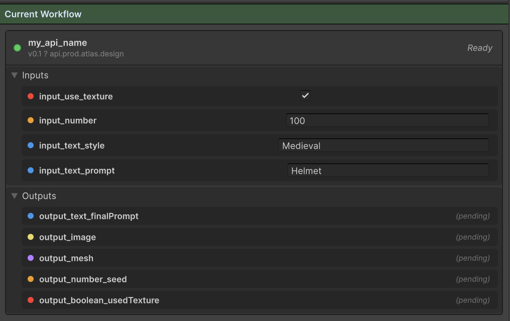
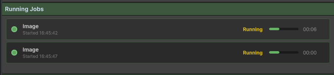
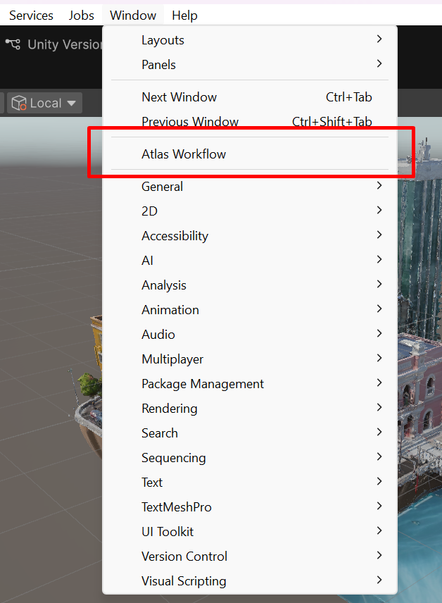
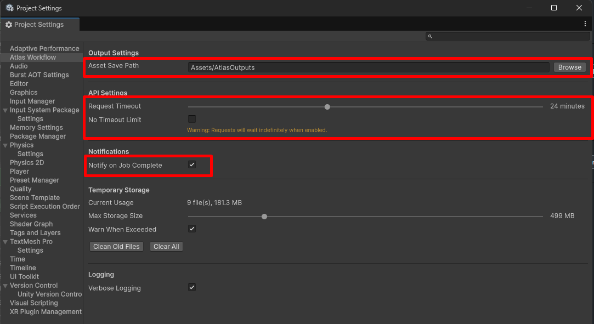
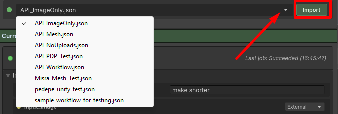

<p align="center">
  
</p>

<h1 align="center">Atlas Workflow</h1>

<p align="center">
  <strong>A powerful Unity Editor plugin for orchestrating and executing Atlas Platform workflows</strong>
</p>

<p align="center">
  
  
  
  
</p>

<p align="center">
  <a href="#-features">Features</a> •
  <a href="#-installation">Installation</a> •
  <a href="#-quick-start">Quick Start</a> •
  <a href="#-documentation">Documentation</a> •
  <a href="#-configuration">Configuration</a> •
  <a href="#-troubleshooting">Troubleshooting</a>
</p>

--- 

## 📋 Table of Contents

- [Overview](#-overview)
- [Features](#-features)
- [Screenshots](#-screenshots)
- [Requirements](#-requirements)
- [Installation](#-installation)
- [Quick Start](#-quick-start)
- [Documentation](#-documentation)
  - [Core Concepts](#core-concepts)
  - [Jobs Window and History Views](#jobs-window-and-history-views)
  - [Batch Workflows](#batch-workflows)
  - [Workflow Schema](#workflow-schema)
  - [Input Types](#input-types)
  - [Output Types](#output-types)
- [Configuration](#-configuration)
- [File Structure](#-file-structure)
- [Troubleshooting](#-troubleshooting)
- [License](#-license)

---

## 🎯 Overview

**Atlas Workflow** is a Unity Editor plugin that brings the power of Atlas Platform workflows directly into your Unity development environment. Design, execute, and iterate on AI-powered asset generation pipelines without leaving the editor.

Whether you're generating textures, creating 3D models, or running complex multi-step AI pipelines, Atlas Workflow provides a seamless interface for managing your creative automation workflows.

### Why Atlas Workflow?

- **Native Unity Integration** — Run workflows from dedicated **Atlas** editor windows and optional toolbar shortcuts
- **Type-Safe Inputs** — Structured UI for supported parameter types with validation
- **Asset Pipeline Support** — Export textures (PNG), meshes (GLB), and download **audio** outputs using each workflow’s declared `format` (e.g. MP3)
- **Batch Runs** — Queue many parameter sets for the **same** workflow with concurrency, transient retries, and per-row jobs tagged with batch metadata
- **Jobs Window** — **Running Jobs** and **Job History** live in **Atlas → Atlas Job History**, so the main workflow window stays focused on a single run
- **Batches in History** — Switch **Job History** between **Jobs** (flat list) and **Batches** (catalog of batch runs, then drill into member jobs)
- **Production-Ready** — Built for iterative, professional game development workflows

---

## ✨ Features

### Workflow Management
- 📁 **Workflow Library** — Import, organize, and switch between multiple workflow definitions (shared across single-run and batch editors)
- 🔄 **Hot-Reload Support** — Update workflow definitions without restarting Unity

### Intelligent Input System
- 🎨 **Image Inputs** — Drag-and-drop textures from your project or browse external files
- 🧊 **Mesh Inputs** — Use prefabs, models, or external GLB/FBX files
- 🔢 **Primitive Inputs** — Boolean toggles, numeric sliders, and text fields
- 📂 **Dual Source Support** — Choose between project assets or file system paths
- ⚠️ **Audio inputs** — Not supported in this plugin version; workflows that only need audio as an **output** are supported

### Single-Run Execution
- ▶️ **One-Click Execution** — Run the loaded workflow from **Atlas → Atlas Workflow**
- ⏱️ **Configurable Timeouts** — Set execution limits from 1 minute to 1 hour (or unlimited)
- 🔔 **Completion Notifications** — Get notified when jobs finish or fail

### Batch Editor (**Atlas → Atlas Batch**)
- 📋 **Row-Based Queue** — Add, duplicate, delete, and reorder rows; each row is one job instance of the selected workflow
- 🔁 **Parallelism & Retries** — Cap concurrent runs; retry **transient** failures (network/timeout-style errors) up to a per-batch limit without retrying explicit API workflow failures
- 🛑 **Cancel Batch** — Stop scheduling new instances and cancel in-flight polling; **Dismiss** on a card in Running Jobs is separate from batch cancel
- 💾 **Save / Load Drafts** — Persist batch definitions under `Application.persistentDataPath` (see [Runtime Data Locations](#runtime-data-locations)); run manifests record batch metadata alongside on-disk jobs

### Jobs Window (**Atlas → Atlas Job History**)
- 📊 **Running Jobs** — Live list with batch labels and tooltips; updates when jobs are created or complete
- 📜 **Job History** — Same filters you expect (status, type, date) with mode-specific behavior in **Batches** view
- 🔀 **Jobs | Batches** — **Jobs**: every job in one list (including batch-created jobs). **Batches**: one row per batch run; open a batch to see only its jobs; **← Batches** returns to the catalog

### Results & Assets
- 🔍 **Full Inspection** — View exact inputs and outputs for any historical job
- 💾 **Persistent Storage** — Job folders survive editor restarts
- 📥 **Import** — Bring generated images, meshes, and **audio** into the project where supported (including **AudioClip** import for audio files when available)
- 📂 **File Reveal** — Open output folders from the UI

### Asset Pipeline
- 🖼️ **Texture Export** — Automatic PNG conversion with GPU decompression
- 🎮 **GLB Export** — Full glTF 2.0 binary export via glTFast (import uses the package’s GLB pipeline)
- 🔊 **Audio Download** — Binary results use the workflow output `format` for the file extension when safe (fallback documented in logs if the format is unusable)
- 🧹 **Temp File Management** — Configurable cleanup with storage limits

---

## 📸 Screenshots

<p align="center">
  
  <br/>
  <em>Main Editor Window — Load workflows, configure inputs, and execute</em>
</p>

<p align="center">
  
  <br/>
  <em>Type-aware input fields with project asset and file path support</em>
</p>

<p align="center">
  
  <br/>
  <em>Job History — Browse, filter, and inspect past workflow executions</em>
</p>

<p align="center">
  
  <br/>
  <em>Running Jobs Panel — Monitor active workflow executions</em>
</p>

<p align="center">
  
  <br/>
  <em>Project Settings — Configure save paths, timeouts, and notifications</em>
</p>

> **Screenshot to add:** `Docs~/Images/AtlasBatchEditor.png` — **Atlas Batch** window after selecting a workflow, showing multiple rows and Run batch / Cancel batch (no sensitive data).

> **Screenshot to add:** `Docs~/Images/AtlasJobHistoryWindow.png` — **Atlas Job History** window with Running Jobs and Job History split; **Jobs | Batches** toggle visible (no sensitive data).

> **Screenshot to add:** `Docs~/Images/JobHistoryBatchesMode.png` — Job History in **Batches** mode: batch catalog or drill-in with **← Batches** (no sensitive data).

---

## 📦 Requirements

| Requirement | Version |
|-------------|---------|
| **Unity** | 2023.1 or newer (see `package.json`) |
| **Newtonsoft JSON** | 3.2.2+ (auto-installed) |
| **glTFast** | 6.14.1+ (auto-installed) |

> **Note:** An active Atlas Platform backend connection is required for workflow execution.

---

## 🚀 Installation

### Option A: Install via Git URL (Recommended)

1. Open Unity and navigate to **Window → Package Manager**
2. Click the **+** button in the top-left corner
3. Select **Add package from git URL...**
4. Paste the following URL:

```
https://github.com/Atlas-Design/AtlasPlatform_UnityPlugin.git
```

5. Click **Add** and wait for the installation to complete

### Option B: Install from Disk (Local Development)

1. Clone or download this repository:

```bash
git clone https://github.com/Atlas-Design/AtlasPlatform_UnityPlugin.git
```

2. In Unity, navigate to **Window → Package Manager**
3. Click the **+** button and select **Add package from disk...**
4. Navigate to the cloned repository and select `package.json`

### Verifying Installation

After installation, you should see under the top menu **Atlas**:
- **Atlas Workflow** — single-run workflow editor
- **Atlas Batch** — batch queue for one workflow at a time
- **Atlas Job History** — running jobs + history
- **Atlas Workflow Settings** — opens **Edit → Project Settings → Project → Atlas Workflow**

On **Unity 6.3+**, an **Atlas** dropdown may also appear on the main toolbar (visibility: right-click the toolbar → context menu → **Atlas** section → **Menu**).

---

## 🏃 Quick Start

### Step 1: Open the workflow editor

Open **Atlas → Atlas Workflow** (main window: library, inputs, **Run**).

<p align="center">
  
</p>

### Step 2: Configure Settings

Open **Atlas → Atlas Workflow Settings** (or **Edit → Project Settings → Project → Atlas Workflow**) and configure:

- **Asset Save Folder** — Where imported assets will be saved (must be inside `Assets/`)
- **API Timeout** — Maximum time to wait for workflow completion
- **Notifications** — Enable/disable completion dialogs

<p align="center">
  
</p>

### Step 3: Import a Workflow

1. Click the **Import** button in the editor window
2. Select a workflow JSON file from your file system
3. The workflow will be added to your library and loaded automatically

<p align="center">
  
</p>

### Step 4: Configure Inputs

Fill in the required inputs for your workflow:

| Input Type | How to Set |
|------------|------------|
| **Boolean** | Toggle checkbox |
| **Number** | Enter numeric value |
| **String** | Type text in field |
| **Image** | Drag texture from project OR click browse for external file |
| **Mesh** | Drag prefab from project OR click browse for external file |

### Step 5: Execute

Click the **▶ Run [Workflow Name]** button to execute. Open **Atlas → Atlas Job History** to watch **Running Jobs** and browse **Job History**.

### Step 6: View Results

- **Live Results** — Outputs appear in the main workflow view after completion
- **History** — Open **Atlas → Atlas Job History**; use **Jobs** for a flat list or **Batches** after batch runs
- **Import Assets** — Use import / reveal actions on file outputs (images, meshes, audio) as provided in the UI

### Optional: Batch many runs

1. Open **Atlas → Atlas Batch**
2. Pick the same workflow from the library and add rows (duplicate / reorder as needed)
3. Set **max concurrency** and **max retries** (transient errors) if shown
4. **Run batch** — each row becomes a normal on-disk job with shared batch metadata. Use **Cancel batch** to stop the queue. Inspect runs in **Atlas → Atlas Job History** (**Batches** mode groups by batch).

---

## 📖 Documentation

### Core Concepts

#### Workflow

A **Workflow** is a JSON definition that describes:
- **Inputs** — Parameters required to execute the workflow
- **Outputs** — Results produced by the workflow
- **Metadata** — API endpoint, version, and identification info

Workflows are stored in a local library (`Application.persistentDataPath/AtlasWorkflowLibrary/`).

#### Job

A **Job** represents a single execution of a workflow. Each job contains:

| Property | Description |
|----------|-------------|
| `JobId` | Unique identifier (GUID) |
| `WorkflowId` | Reference to the source workflow |
| `BatchId` / `BatchIndex` | Present when the job was created from a batch (optional) |
| `Status` | Running, Succeeded, or Failed |
| `CreatedAtUtc` | Execution start time |
| `CompletedAtUtc` | Execution end time |
| `InputsSnapshot` | Frozen copy of input values at execution time |
| `OutputsSnapshot` | Generated output values |
| `ErrorMessage` | Error details (if failed) |

Jobs are **immutable** once completed, ensuring historical accuracy.

Batch-created jobs may also store **batch metadata** (for example `BatchId`, `BatchIndex`, and an optional batch label) so history and manifests can group related runs.

#### Batch run

A **batch run** executes the **same** workflow multiple times with different input rows. The batch editor schedules jobs with shared batch identifiers; **Atlas → Atlas Job History** can show either every job (**Jobs**) or one entry per batch (**Batches** → drill in for member jobs).

#### Live View vs History View

| Aspect | Live View | History View |
|--------|-----------|--------------|
| **Inputs** | Editable | Read-only |
| **Outputs** | Updates after completion | Frozen snapshot |
| **Actions** | Execute workflow | Reveal/import files |
| **Purpose** | Current work | Audit trail |

---

### Jobs window and history views

Use **Atlas → Atlas Job History** for:

- **Running Jobs** — Active and recently finished runs; batch rows may show batch index tooltips. **Cancel** applies to the in-editor single run when this window participates in that session; **Dismiss** is for jobs you did not start here (typical for batch-created jobs).
- **Job History** — Select any past job to inspect frozen inputs/outputs in the detail pane.

**Jobs | Batches** (top of the history toolbar):

| Mode | List | Detail |
|------|------|--------|
| **Jobs** | All jobs, flat | Same job inspector as today; optional hints when a job belongs to a batch |
| **Batches** | One row per distinct `BatchId` | Select a batch to filter the list to its jobs; **← Batches** returns to the catalog |

Filter tooltips in the UI describe how **Status**, **Type**, and **Date** apply in each mode (for example, **Type** is not used for the batch catalog because each batch is a single workflow).

---

### Batch workflows

- **Editor:** **Atlas → Atlas Batch** — one scrollable panel: workflow picker, read-only input summary, editable rows, concurrency and transient-retry settings, **Run batch** / **Cancel batch**, and draft **Save** / **Load** where exposed in the UI.
- **Validation:** Rows are checked against the loaded workflow’s input schema before run.
- **On disk:** Each instance is still a normal job folder under `[ProjectRoot]/AtlasWorkflowJobs/`. Drafts and run manifests also live under `Application.persistentDataPath/AtlasWorkflowBatches/` (see [Runtime Data Locations](#runtime-data-locations)).
- **Retries:** Only **transient** failures (e.g. network/timeout-style errors) are retried up to the configured cap; explicit API **workflow failed** responses are not auto-retried.
- **Roadmaps:** See `BatchWorkflowRoadmap.md` and `AudioFeatureRoadmap.md` in this package for design notes and phase tracking.

---

### Workflow Schema

Workflow definitions use the following JSON schema:

```json
{
  "version": "v1",
  "api_id": "my-workflow-001",
  "base_url": "api.atlas-platform.com",
  "name": "My Awesome Workflow",
  "inputs": [
    {
      "id": "input_texture",
      "type": "image",
      "label": "Source Texture"
    },
    {
      "id": "strength",
      "type": "number",
      "label": "Effect Strength",
      "default_value": 0.5
    }
  ],
  "outputs": [
    {
      "id": "result_image",
      "type": "image",
      "format": "png"
    },
    {
      "id": "result_audio",
      "type": "audio",
      "format": "mp3"
    }
  ]
}
```

#### Schema Reference

| Field | Type | Required | Description |
|-------|------|----------|-------------|
| `version` | string | ✅ | API version (e.g., "v1") |
| `api_id` | string | ✅ | Unique workflow identifier |
| `base_url` | string | ✅ | Atlas Platform endpoint |
| `name` | string | ✅ | Human-readable workflow name |
| `inputs` | array | ✅ | Input parameter definitions |
| `outputs` | array | ✅ | Output parameter definitions |
| `outputs[].format` | string | Recommended for file outputs | e.g. `png`, `glb`, `mp3` — used for download naming (especially `audio`) |

---

### Input Types

| Type | JSON Value | Unity UI | Export Format |
|------|------------|----------|---------------|
| `boolean` | `true`/`false` | Toggle | JSON boolean |
| `number` | `0.0` | Float field | JSON number |
| `string` | `"text"` | Text field | JSON string |
| `image` | — | Object field + file picker | PNG file |
| `mesh` | — | Object field + file picker | GLB file |
| `audio` | — | *Not supported as input* | — |

#### Image Input Sources

```
┌─────────────────────────────────────────┐
│  Image Input                            │
├─────────────────────────────────────────┤
│  ○ Project Asset                        │
│    [Texture2D field]                    │
│                                         │
│  ○ External File                        │
│    [File path] [Browse...]              │
└─────────────────────────────────────────┘
```

#### Mesh Input Sources

```
┌─────────────────────────────────────────┐
│  Mesh Input                             │
├─────────────────────────────────────────┤
│  ○ Project Asset                        │
│    [GameObject/Prefab field]            │
│                                         │
│  ○ External File                        │
│    [File path] [Browse...]              │
└─────────────────────────────────────────┘
```

---

### Output Types

| Type | Result | Actions Available |
|------|--------|-------------------|
| `boolean` | Checkbox display | Copy value |
| `number` | Numeric display | Copy value |
| `string` | Text display | Copy value |
| `image` | Image preview | Import to project, Reveal in explorer |
| `mesh` | File reference | Import to project, Reveal in explorer |
| `audio` | File reference (extension from `format`, e.g. `.mp3`) | Reveal in explorer; import as **AudioClip** when the UI offers it |

---

## ⚙️ Configuration

Access settings via **Atlas → Atlas Workflow Settings** or **Edit → Project Settings → Project → Atlas Workflow**

### General Settings

| Setting | Default | Description |
|---------|---------|-------------|
| **Asset Save Folder** | `Assets/AtlasOutputs` | Where imported assets are saved |

### Execution Settings

| Setting | Default | Range | Description |
|---------|---------|-------|-------------|
| **API Timeout** | 10 minutes | 1 min – 60 min (or No Limit) | Maximum wait time for API responses |
| **Notify on Complete** | ✅ Enabled | — | Show dialog when jobs finish |

### Storage Settings

| Setting | Default | Range | Description |
|---------|---------|-------|-------------|
| **Max Temp Storage** | 500 MB | 100 MB – 5 GB | Warning threshold for temp files |
| **Warn on Exceeded** | ✅ Enabled | — | Log warning when limit exceeded |

### Logging Settings

| Setting | Default | Description |
|---------|---------|-------------|
| **Verbose Logging** | ❌ Disabled | Enable detailed debug logs |

---

## 📁 File Structure

### Plugin Structure

```
com.atlas.workflow/
├── Editor/
│   ├── EditorWindow/           # UI (AtlasWorkflowEditor, AtlasWorkflowJobsWindow, batch editor, job/history views)
│   │   ├── BatchWizard/        # WorkflowBatchEditorWindow + session/view
│   │   ├── Elements/           # UXML templates
│   │   ├── Params/             # Parameter input templates
│   │   └── Styles/             # USS stylesheets
│   └── Logic/                  # API, jobs, batch models, persistence, GLB import/export helpers
│       ├── AtlasAPIController.cs
│       ├── AssetExporter.cs
│       ├── GLBImporter.cs
│       ├── SettingsManager.cs
│       ├── WorkflowManager.cs
│       ├── WorkflowDefinition.cs
│       ├── WorkflowBatchPersistence.cs
│       └── …
├── Docs~/
│   └── Images/                 # Documentation images
├── Tests/
│   └── TestAssets/             # Test files
├── package.json
├── LICENSE
├── README.md
├── BatchWorkflowRoadmap.md     # Batch feature design / phases
└── AudioFeatureRoadmap.md      # Audio output design / phases
```

### Runtime Data Locations

| Data | Location | Persistence |
|------|----------|-------------|
| **Workflow Library** | `Application.persistentDataPath/AtlasWorkflowLibrary/` | Permanent |
| **Job History** | `[ProjectRoot]/AtlasWorkflowJobs/` | Permanent |
| **Batch drafts & run manifests** | `Application.persistentDataPath/AtlasWorkflowBatches/` (`drafts/`, `runs/`) | Permanent |
| **Temporary Files** | `System.IO.Path.GetTempPath()/UnityAtlasWorkflow/` | Auto-cleanup (7 days) |
| **Imported Assets** | Configurable (default: `Assets/AtlasOutputs/`) | Permanent |

### Job Folder Structure

```
AtlasWorkflowJobs/
└── My_Workflow/
    └── 2026-01-22_14-30-45_a1b2c3d4/
        ├── job.json              # Job metadata & snapshots
        ├── inputs/
        │   ├── Input_texture.png
        │   └── Input_mesh.glb
        └── outputs/
            ├── Output_result.png
            ├── Output_model.glb
            └── Output_result_audio.mp3
```

---


## 🔧 Troubleshooting

### Common Issues

#### "Workflow execution failed"

**Possible causes:**
- Network connectivity issues
- Invalid API endpoint in workflow definition
- API timeout exceeded

**Solutions:**
1. Check your internet connection
2. Verify `base_url` in workflow JSON is correct
3. Increase timeout in Project Settings

#### "Failed to export texture/mesh"

**Possible causes:**
- Asset is not readable (texture compression)
- Missing glTFast package

**Solutions:**
1. For textures: Ensure "Read/Write" is enabled in import settings
2. Verify glTFast package is installed correctly
3. Check Console for detailed error messages

#### "Audio output missing or wrong extension"

**Possible causes:**
- Backend did not return a downloadable file id for the audio output
- Workflow JSON `format` is missing or not safe to use as a file extension (plugin may fall back to `.bin`)

**Solutions:**
1. Confirm the workflow declares `"type": "audio"` and a valid `"format"` (e.g. `mp3`) in outputs
2. Check Console for Atlas API / download log lines
3. If imports fail, use **Reveal** to confirm the file on disk, then import manually if needed

#### "Batch run keeps failing" / "Cancel batch vs Dismiss"

**Solutions:**
1. Use **Atlas → Atlas Batch** → **Cancel batch** to stop the queue and in-flight polling; **Dismiss** on a running-job card in **Atlas Job History** does not replace batch cancel for runs you started from the batch editor
2. Remember: **transient** retries do not apply when the API returns a clear workflow failure — fix inputs or the workflow definition
3. See `BatchWorkflowRoadmap.md` for semantics and edge cases

#### "Job history not loading"

**Possible causes:**
- Corrupted job.json files
- Permission issues with job folders

**Solutions:**
1. Check `[ProjectRoot]/AtlasWorkflowJobs/` for corrupted files
2. Delete problematic job folders manually
3. Ensure write permissions on the directory

#### "Temp storage warning"

**Cause:** Temporary files exceed configured limit

**Solutions:**
1. Go to **Project Settings → Atlas Workflow**
2. Click "Clear All Temp Files" or increase the limit
3. Temp files auto-cleanup after 7 days

### Verbose Logging

Enable verbose logging for detailed diagnostics:

1. Open **Atlas → Atlas Workflow Settings** (or **Edit → Project Settings → Project → Atlas Workflow**)
2. Enable **Verbose Logging**
3. Check the Console window for detailed logs with prefixes:
   - `[Atlas/API]` — API communication
   - `[Atlas/File]` — File operations
   - `[Atlas/Job]` — Job lifecycle events

---

## 📄 License

This project is licensed under the **MIT License** — see the [LICENSE](LICENSE) file for details.

---

<p align="center">
  <strong>Built with ❤️ by the Atlas Team</strong>
</p>
